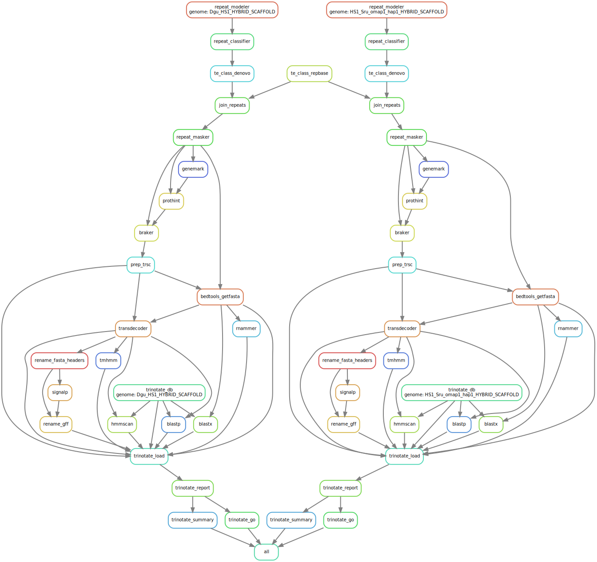

```{r setup, include=FALSE}
rm(list = ls()) ; invisible(gc()) ; set.seed(42)
library(knitr)
library(tidyverse)
theme_set(bayesplot::theme_default())
opts_chunk$set(echo = F, message = F, warning = F, fig.height = 6, fig.width = 8,
               cache = F, cache.lazy = F)
```

[`singularity` & `snakemake`](https://github.com/sylvainschmitt/snakemake_singularity) workflow to annotate genomes.

```{r dag, fig.cap="Workflow."}

```

# Installation

- [x] Python ≥3.5
- [x] Snakemake ≥5.24.1
- [x] Golang ≥1.15.2
- [x] Singularity ≥3.7.3
- [x] This workflow

```{bash, eval=F, echo=T}
# Python
sudo apt-get install python3.5
# Snakemake
sudo apt install snakemake`
# Golang
export VERSION=1.15.8 OS=linux ARCH=amd64  # change this as you need
wget -O /tmp/go${VERSION}.${OS}-${ARCH}.tar.gz https://dl.google.com/go/go${VERSION}.${OS}-${ARCH}.tar.gz && \
sudo tar -C /usr/local -xzf /tmp/go${VERSION}.${OS}-${ARCH}.tar.gz
echo 'export GOPATH=${HOME}/go' >> ~/.bashrc && \
echo 'export PATH=/usr/local/go/bin:${PATH}:${GOPATH}/bin' >> ~/.bashrc && \
source ~/.bashrc
# Singularity
mkdir -p ${GOPATH}/src/github.com/sylabs && \
  cd ${GOPATH}/src/github.com/sylabs && \
  git clone https://github.com/sylabs/singularity.git && \
  cd singularity
git checkout v3.7.3
cd ${GOPATH}/src/github.com/sylabs/singularity && \
  ./mconfig && \
  cd ./builddir && \
  make && \
  sudo make install
# detect Mutations
git clone git@github.com:sylvainschmitt/genomeAnnotation.git
cd genomeAnnotation
```

# Usage

## Locally

```{bash, eval=F, echo=T}
snakemake -np -j 3 --resources mem_mb=10000 # dry run
snakemake --dag | dot -Tsvg > dag/dag.svg # dag
snakemake --use-singularity -j 3 --resources mem_mb=10000 # run
```


## HPC

```{bash, eval=F, echo=T}
module load bioinfo/snakemake-5.25.0 # for test on node
snakemake -np # dry run
sbatch job.sh # run
snakemake --dag | dot -Tsvg > dag/dag.svg # dag
```

# Workflow

<!-- https://www.bioinformatics.uni-muenster.de/publication_data/P.californicus_annotation/repeat_masking.hbi?lang=en -->

## Transposable elements (TE)

<!-- ### [repet](https://github.com/sylvainschmitt/genomeAnnotation/blob/main/rules/repet.smk) -->

<!-- * Tools: [REPET](https://urgi.versailles.inra.fr/Tools/REPET) -->
<!-- * Singularity: docker://urgi/docker_vre_aio -->

### [repeat_modeler](https://github.com/sylvainschmitt/genomeAnnotation/blob/main/rules/repeat_modeler.smk)

* Tools: [RepeatModeler](https://github.com/Dfam-consortium/RepeatModeler)
* Singularity: docker://dfam/tetools

### [repeat_classifier](https://github.com/sylvainschmitt/genomeAnnotation/blob/main/rules/repeat_classifier.smk)

* Tools: [RepeatClassifier](https://github.com/Dfam-consortium/RepeatModeler)
* Singularity: docker://dfam/tetools

### [te_class_denovo](https://github.com/sylvainschmitt/genomeAnnotation/blob/main/rules/te_class_denovo.smk)

* Tools: [TEclass](https://www.compgen.uni-muenster.de/tools/teclass/index.hbi?lang=en)
* Singularity: docker://hatimalmutairi/teclass-2.1.3b

### [te_class_repbase](https://github.com/sylvainschmitt/genomeAnnotation/blob/main/rules/te_class_repbase.smk)

* Tools: [TEclass](https://www.compgen.uni-muenster.de/tools/teclass/index.hbi?lang=en)
* Singularity: docker://hatimalmutairi/teclass-2.1.3b
* Base: [RepBase](https://www.girinst.org/server/RepBase/index.php)

### [join_repeats](https://github.com/sylvainschmitt/genomeAnnotation/blob/main/rules/join_repeats.smk)

* Tools: `cat`

### [repeat_masker](https://github.com/sylvainschmitt/genomeAnnotation/blob/main/rules/repeat_masker.smk)

* Tools: [RepeatMasker](https://stab.st-andrews.ac.uk/wiki/index.php/Repeatmasker)
* Singularity: docker://pegi3s/repeat_masker

## Genes

### [genemark](https://github.com/sylvainschmitt/genomeAnnotation/blob/main/rules/genemark.smk)

* Tools: [gmes_petap.pl](http://exon.gatech.edu/GeneMark/)
* Singularity: docker://blaxterlab/braker

### [braker](https://github.com/sylvainschmitt/genomeAnnotation/blob/main/rules/braker.smk)

* Tools: [prothint.py](https://github.com/gatech-genemark/ProtHint)
* Singularity: docker://blaxterlab/braker

### [braker](https://github.com/sylvainschmitt/genomeAnnotation/blob/main/rules/braker.smk)

* Tools: [braker.pl](https://github.com/Gaius-Augustus/BRAKER#running-braker)
* Singularity: docker://hamiltonjp/braker2:a765b80

## Functional annotation
